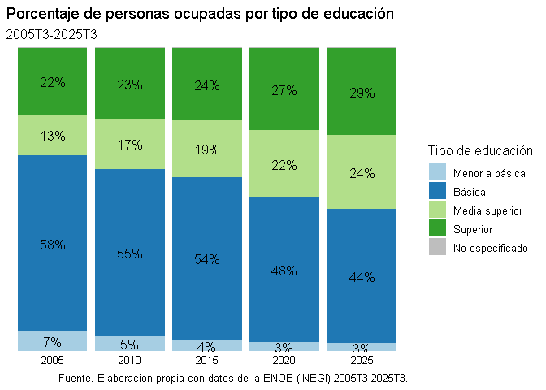

# Una aplicación de las funciones que automatizan la descarga de microdatos de la ENOE
Ramón Carrillo
2026-12-08

# Introducción

En este documento se realizará una aplicación (sencilla) de las
funciones que automatizan la descarga de microdatos de la ENOE creadas
en el presente proyecto.

El objetivo será conocer el número relativo de personas ocupadas por
tipo de educación (formal) en el periodo 2005-2025, es decir, desde la
aplicación de la ENOE hasta la actualidad. Para simplificar el análisis
se realizará de forma quinquenal, esto es, cada cinco años. En
específico, se obtendrán los microdatos correspondientes al tercer
trimestre de la tabla sociodemográfica (SDEM) de los años 2005, 2010,
2015, 2020 y 2025.

## Requisitos

``` r
library(tidyverse)
library(here)
library(arrow)
library(scales)
library(RColorBrewer)

source(here::here("scripts", "0_funciones.R"))
```

# Desarrollo

## Extracción de datos

Como solamente se requieren los microdatos de una sola tabla por
periodo, se utilizará la función `descargar_modulo`. Asimismo, para
facilitar la manipulación de datos de las cinco tablas (donde cada una
contiene alrededor de 400 mil observaciones), se descargarán los datos
en formato parquet y se cargarán en R como objetos `dataset` de Arrow.

Recordemos que las funciones `descargar_modulo` y `descargar_enoe`
cuando se especifica `formato = "parquet"` devuelven un objeto tipo
`dataset` de Arrow, almacenando el o los archivos parquet en la carpeta
`ENOE` dentro del directorio actual de trabajo.

Así pues, podríamos ejecutar la función de esta manera:

```` markdown
```{r}
sdem_2005 <- descargar_modulo(2005, 3, "sdem", "parquet")
sdem_2010 <- descargar_modulo(2010, 3, "sdem", "parquet")
sdem_2015 <- descargar_modulo(2015, 3, "sdem", "parquet")
sdem_2020 <- descargar_modulo(2020, 3, "sdem", "parquet")
sdem_2025 <- descargar_modulo(2025, 3, "sdem", "parquet")
```
````

Pero, como solamente nos interesa los archivos parquet generados, este
procedimiento se puede iterar en un mismo objeto.

```` markdown
```{r}
year_inicio <- 2005
year_final <- 2025

while (year_inicio <= year_final) {
  sdem <- descargar_modulo(year_inicio, 3, "sdem", "parquet")

  year_inicio <- year_inicio + 5
}
```
````

De este modo, se descargan los microdatos de la tabla SDEM de forma
quinquenal, empezando por el año 2005. La función `descargar_modulo`
primero descarga el archivo del periodo correspondiente, después extrae
la tabla especificada, lo carga en R como tibble (mediante `read_csv`) y
posteriormente lo almacena en el directorio actual de trabajo en la
subcarpeta `ENOE`.

``` r
archivo_parquet <- list.files(file.path(here::here(), "ENOE"), "\\.parquet", full.names = TRUE)

tibble(
  file = basename(archivo_parquet),
  size = file.size(archivo_parquet) / 1024**2
)
```

    # A tibble: 5 × 2
      file                    size
      <chr>                  <dbl>
    1 ENOE_SDEMT325.parquet  19.6 
    2 ENOEN_SDEMT320.parquet  9.22
    3 SDEMT305.parquet       15.0 
    4 SDEMT310.parquet       15.1 
    5 SDEMT315.parquet       11.6 

Ahora se cargan las tablas Arrow como conjunto de datos:

``` r
datos <- open_dataset(archivo_parquet, format = "parquet", unify_schemas = TRUE)

datos
```

    FileSystemDataset with 5 Parquet files
    125 columns
    r_def: string
    cve_loc: string
    cve_mun: string
    est: string
    est_d_tri: string
    est_d_men: string
    cve_ageb: string
    t_loc_tri: string
    t_loc_men: string
    cd_a: string
    cve_ent: string
    con: string
    upm: string
    d_sem: string
    n_pro_viv: string
    v_sel: string
    n_hog: string
    h_mud: string
    n_ent: string
    per: string
    ...
    105 more columns
    Use `schema()` to see entire schema

    See $metadata for additional Schema metadata

Se observa que todas las variables (columnas) son de tipo cadena de
texto (`string`). Esto es resultado de cargar el archivo descargado (y
extraído) como tibble con `readr::read_csv`, y no con
`arrow::read_csv_arrow`, especificando como tipo de dato el tipo cadena
de texto (`as.character`) en todas las columnas de la tablas SDEM en la
función `descargar_modulo`. Se decidió realizarlo de esta manera para
evitar posibles errores de codificación al momento de ejecutar
instrucciones desde el conjunto de datos.

## Transformación de datos

Para poder estimar el total de la población ocupada se requiere el campo
que contiene la ponderación (trimestral) de la muestra. No obstante, en
el periodo 2005T1-2020T1 el ponderador está ubicado en el campo `fac`,
mientras que desde 2020T3-en adelante se ubica en el campo `fac_tri`.

Por ese motivo, se añadió el argumento `unify_schemas = TRUE` dado que
por defecto `open_dataset` solamente lee el contenido del primer archivo
de la ruta especificada. De otro modo, generará error al momento de
utilizar campos no contenidos en el primer archivo como, entre otros, el
ponderador del periodo 2005-2020 (`fac`).

```` markdown
```{r}
datos <- open_dataset(archivo_parquet, format = "parquet")

datos |>
  mutate(ponderador1 = as.double(fac)) |>
  summarise(tot1 = sum(ponderador1)) |> 
  collect() 
```
````

    Error in `as.double()`:
    ! objeto 'fac' no encontrado

Entonces, de momento tenemos dos campos que contienen una misma
variable: ponderación de la muestra. Esto provoca duplicar los cálculos.
Por ejemplo, si deseamos conocer el total de la población mexicana por
periodo.

``` r
datos |>
  mutate(
    ponderador1 = as.double(fac), 
    ponderador2 = as.double(fac_tri),
    file = arrow::add_filename()
  ) |> 
  compute() |>
  group_by(file) |> 
  summarise(
    tot1 = sum(ponderador1),
    tot2 = sum(ponderador2)
  ) |> 
  collect() |> 
  mutate(file = basename(file))
```

    # A tibble: 5 × 3
      file                        tot1      tot2
      <chr>                      <dbl>     <dbl>
    1 ENOEN_SDEMT320.parquet        NA 126554112
    2 SDEMT305.parquet       105077468        NA
    3 SDEMT310.parquet       112552063        NA
    4 ENOE_SDEMT325.parquet         NA 130760049
    5 SDEMT315.parquet       119219891        NA

Por tanto, debemos construir un campo que contenga la información de
ambos ponderadores.

``` r
datos |>
  mutate(
    ponderador = if_else(!is.na(fac), fac, fac_tri), 
    ponderador = as.double(ponderador),
    file = arrow::add_filename()
  ) |> 
  compute() |>
  group_by(file) |> 
  summarise(tot = sum(ponderador)) |> 
  ungroup() |> 
  collect() |> 
  mutate(file = basename(file))
```

    # A tibble: 5 × 2
      file                         tot
      <chr>                      <dbl>
    1 ENOEN_SDEMT320.parquet 126554112
    2 SDEMT305.parquet       105077468
    3 SDEMT310.parquet       112552063
    4 ENOE_SDEMT325.parquet  130760049
    5 SDEMT315.parquet       119219891

Asimismo, como se requiere estimar el total de la población ocupada por
tipo de educación se deben aplicar los criterios descritos por INEGI
(2023). Y como la ENOE no contiene un campo referente al tipo de
educación (formal) de la persona encuestada utilizaremos, como primera
aproximación, el campo `cs_p13_1` que describe el nivel educativo
reportado por los individuos.

Así pues, nuestra consulta queda como sigue:

``` r
datos_proc <- datos |>
  # criterio general
  filter(r_def == "0" & (c_res == "1" | c_res == "3") & eda7c != "0") |>
  # población ocupada
  filter(clase2 == "1") |>
  mutate(
    # se crea campo que unifica ponderador ya que
    # de 2005 a 2015 es `fac` y de 2020 a 2025 es `fac_tri`
    ponderador = if_else(!is.na(fac), fac, fac_tri), 
    ponderador = as.double(ponderador),
    file = arrow::add_filename()
  ) |> 
  compute() |>
  group_by(file, cs_p13_1) |> 
  summarise(tot = sum(ponderador)) |> 
  ungroup() |> 
  collect()

datos_proc |> 
  mutate(file = basename(file))
```

    # A tibble: 55 × 3
       file                   cs_p13_1      tot
       <chr>                  <chr>       <dbl>
     1 ENOEN_SDEMT320.parquet 7        10850380
     2 ENOEN_SDEMT320.parquet 8          923514
     3 ENOEN_SDEMT320.parquet 4        11225681
     4 ENOEN_SDEMT320.parquet 2         9882004
     5 ENOEN_SDEMT320.parquet 3        14305577
     6 ENOEN_SDEMT320.parquet 6         1807971
     7 ENOEN_SDEMT320.parquet 5           63489
     8 ENOEN_SDEMT320.parquet 0         1528955
     9 ENOEN_SDEMT320.parquet 9          167885
    10 ENOEN_SDEMT320.parquet 99          33129
    # ℹ 45 more rows

A continuación, limpiamos el campo `file` para que muestre solamente el
periodo correspondiente.

``` r
datos_proc |> 
  mutate(
    file = str_c("20", str_extract(file, "05|1\\d{1}|2\\d{1}"))
  )
```

    # A tibble: 55 × 3
       file  cs_p13_1      tot
       <chr> <chr>       <dbl>
     1 2020  7        10850380
     2 2020  8          923514
     3 2020  4        11225681
     4 2020  2         9882004
     5 2020  3        14305577
     6 2020  6         1807971
     7 2020  5           63489
     8 2020  0         1528955
     9 2020  9          167885
    10 2020  99          33129
    # ℹ 45 more rows

Sin embargo, se observa que muestra el total de la población ocupada por
nivel educativo y no por tipo de educación. Por tanto, volvemos a
estimar la población ocupada, pero ahora por tipo de educación. Para lo
cual, creamos una tabla que relaciona ambas columnas (nivel educativo y
tipo de educación) de acuerdo a lo estipulado por la Ley General de
Educación (LGE, 2026) y realizamos nuestros cálculos.

``` r
nivel_tipo_edu <- tribble(
  ~cs_p13_1, ~tipo_edu, ~tipo_edu_label,
  0, 0, "Menor a básica", 
  1, 0, "Menor a básica", 
  2, 1, "Básica", 
  3, 1, "Básica", 
  4, 2, "Media superior", 
  5, 3, "Superior", 
  6, 3, "Superior", 
  7, 3, "Superior", 
  8, 3, "Superior", 
  9, 3, "Superior", 
  99, NA, "No especificado"
  # 99, NA, NA
)

datos_proc <- datos_proc |> 
  mutate(
    file = str_c("20", str_extract(file, "05|1\\d{1}|2\\d{1}")),
    # para unir 
    cs_p13_1 = as.double(cs_p13_1)
  ) |> 
  left_join(nivel_tipo_edu, by = "cs_p13_1") |> 
  select(-tipo_edu_label) |> 
  group_by(file, tipo_edu) |> 
  summarise(tot = sum(tot)) |> 
  ungroup()

datos_proc
```

    # A tibble: 25 × 3
       file  tipo_edu      tot
       <chr>    <dbl>    <dbl>
     1 2005         0  2815369
     2 2005         1 23913053
     3 2005         2  5578621
     4 2005         3  9080548
     5 2005        NA    37770
     6 2010         0  2290608
     7 2010         1 25162067
     8 2010         2  7598359
     9 2010         3 10625329
    10 2010        NA    24755
    # ℹ 15 more rows

Después, calculamos el porcentaje por periodo

``` r
datos_proc <- datos_proc |> 
  # calcular porcentaje
  group_by(file) |> 
  mutate(prop = tot / sum(tot)) |> 
  ungroup() 

datos_proc
```

    # A tibble: 25 × 4
       file  tipo_edu      tot     prop
       <chr>    <dbl>    <dbl>    <dbl>
     1 2005         0  2815369 0.0680  
     2 2005         1 23913053 0.577   
     3 2005         2  5578621 0.135   
     4 2005         3  9080548 0.219   
     5 2005        NA    37770 0.000912
     6 2010         0  2290608 0.0501  
     7 2010         1 25162067 0.551   
     8 2010         2  7598359 0.166   
     9 2010         3 10625329 0.232   
    10 2010        NA    24755 0.000542
    # ℹ 15 more rows

## Visualización de datos

Por último, creamos una gráfica apilada.

``` r
# para las etiquetas
tipo_edu_label <- nivel_tipo_edu |> 
  distinct(tipo_edu, tipo_edu_label)

etiqueta <- setNames(
  object = tipo_edu_label$tipo_edu_label,
  nm = tipo_edu_label$tipo_edu
)

fig_prop <- datos_proc |> 
  mutate(
    prop_label = if_else(prop > 0.01, percent(prop, accuracy = 1), ""),
    tipo_edu = as.character(tipo_edu)
  ) |> 
  ggplot(aes(file, prop, fill = tipo_edu, group = file)) + 
  geom_col() +
  geom_text(aes(label = prop_label), position = position_stack(vjust = 0.5)) + 
  scale_x_discrete(name = NULL) +
  scale_y_continuous(name = NULL, breaks = NULL, expand = 0) + 
  scale_fill_brewer(
    name = "Tipo de educación",
    labels = etiqueta,
    palette = "Paired",
    na.value = "gray"
  ) + 
  theme_classic(base_size = 12, base_family = "Times New Roman") + 
  theme(
    axis.line = element_blank(),
    axis.ticks = element_blank(),
  ) + 
  labs(
    title = "Porcentaje de personas ocupadas por tipo de educación",
    subtitle = "2005T3-2025T3",
    caption = "Fuente. Elaboración propia con datos de la ENOE (INEGI) 2005T3-2025T3."
  )

# guardar figura
directorio <- file.path(here::here(), "figuras")

if (dir.exists(directorio) == FALSE) {dir.create(directorio)}

ggsave(
  file.path(directorio, "fig_prop.png"),
  fig_prop,
  width = 17,
  height = 10,
  units = "cm"
)

fig_prop
```



Se observa que de 2005 a 2025, incrementó en 7 puntos porcentuales (pp)
el porcentaje de personas ocupadas con educación superior. No obstante,
se registra un mayor incremento en el porcentaje de personas con
educación media superior debido que pasó del 13% al 24%, es decir, un
aumento en 11 pp. 

Al mismo tiempo, persiste una proporción significativa de personas
ocupadas con educación básica dado que en 2025 4 de cada 10 personas
ocupadas reportaron dicha educación. Aquello puede relacionarse con
elevados índices de informalidad y bajos niveles de ingreso presentes en
el mercado laboral de nuestro país.

# Conclusiones

La realización de este sencillo ejemplo muestra que las funciones
`descargar_enoe` y `descargar_modulo` reducen el tiempo en la obtención
de microdatos de la ENOE. De este modo, estas funciones permiten
concentrar los recursos (o esfuerzos) en otras etapas del análisis de
datos como la transformación, el análisis, visualización de datos, entre
otros.

# Referencias

INEGI, \[Instituto Nacional de Estadística y Geografía\]. Encuesta
Nacional de Ocupación y Empleo (ENOE). 2005-2025. Tercer Trimestre.
\[Conjunto de datos\]. <https://www.inegi.org.mx/programas/enoe/15ymas/>

INEGI, \[Instituto Nacional de Estadística y Geografía\]. Encuesta
Nacional de Ocupación y Empleo (ENOE). Estructura de la base de datos.
2005T1-2020T1; 2020T3-en adelante.
<https://www.inegi.org.mx/programas/enoe/15ymas/#microdatos>

INEGI, \[Instituto Nacional de Estadística y Geografía\]. (2023).
Encuesta Nacional de Ocupación y Empleo. ENOE. Conociendo la base de
datos.
<https://www.inegi.org.mx/rnm/index.php/catalog/1121/related-materials>

Ley General de Educación, \[LGE\]. (2026). Diario Oficial de la
Federación (DOF). Reformada 15 de enero de 2026 (México).
<https://www.diputados.gob.mx/LeyesBiblio/pdf/LGE.pdf>

Martínez Sánchez, J. C. (2017). Una aproximación metodológica al uso de
datos de encuestas en hogares. Realidad, Datos y Espacio. Revista
Internacional de Estadística y Geografía, 8(2), 52–71.
<https://www.inegi.org.mx/app/biblioteca/ficha.html?upc=702825095352>

Pacheco Castro, C. D. (2021, 15 de julio). Usando R para jugar con los
microdatos del INEGI. tacosdedatos.
<https://medium.com/tacosdedatos/usando-r-para-sacar-informaci%C3%B3n-de-los-microdatos-del-inegi-b21b6946cf4f>

Rentería, C. (2020). importinegi: un paquete de R para descargar y
gestionar bases de datos del INEGI (pp. 140-149). REALIDAD, DATOS Y
ESPACIO REVISTA INTERNACIONAL DE ESTADÍSTICA Y GEOGRAFÍA (Vol. 11, Núm.
3, septiembre-diciembre, 2020).
<https://www.inegi.org.mx/contenidos/productos/prod_serv/contenidos/espanol/bvinegi/productos/nueva_estruc/revista_rde/889463856702.pdf>

Wickham, H.; Cetinkaya-Rundel, M.; y Grolemund, G. (2023). R para la
Ciencia de Datos (2a ed.) \[versión en español, trad. Díaz Rodríguez,
D.\]. <https://davidrsch.github.io/r4ds-es/>
